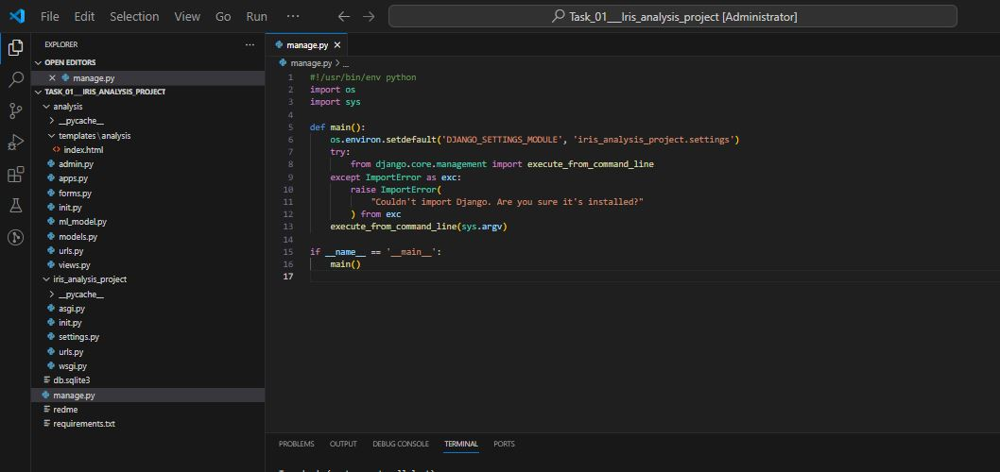
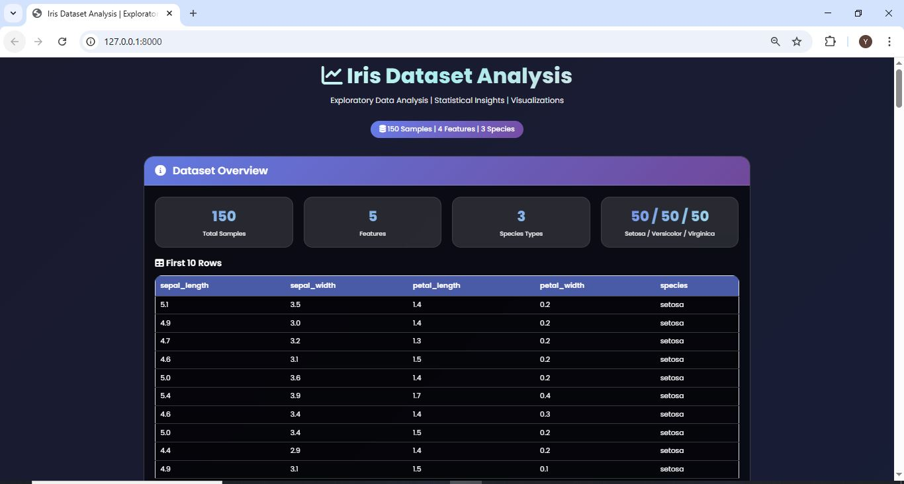
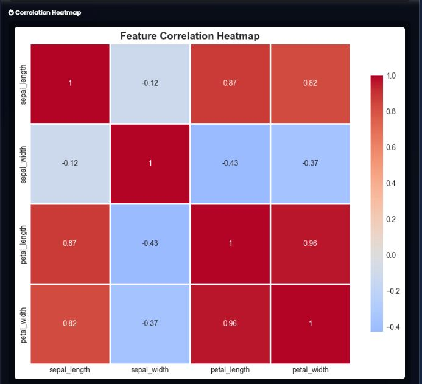

# 🌸 Iris Dataset - Exploratory Data Analysis (EDA) Project

[](https://www.python.org/)
[](https://www.djangoproject.com/)
[](https://pandas.pydata.org/)
[](https://matplotlib.org/)
[](https://seaborn.pydata.org/)
[](LICENSE)

A comprehensive Exploratory Data Analysis (EDA) web application for the famous Iris dataset. Built with Django, this project demonstrates data loading, inspection, statistical analysis, and advanced visualizations.

---

## 📸 Project Screenshots

### 🗂️ Program Structure
The complete project structure and organization.



### 🖥️ Main Dashboard
The main interface showing dataset overview and key statistics.



### 📊 Data Types & Statistical Summary
Comprehensive data type information and statistical summary of the dataset.


### 🌸 Species Distribution & Correlation Analysis
Species distribution visualization and correlation analysis between features.


### 📈 Pairplot - Feature Relationships
Advanced pairplot visualization showing relationships between all features.


### 🔥 Correlation Heatmap
Visual representation of feature correlations with color mapping.



### 📦 Box Plots - Outlier Detection
Box plots for each feature showing outliers across different species.


### 📊 Feature Distributions
Histogram distributions for all features with kernel density estimation.


### 🎯 Scatter Plots - Feature Relationships
2D scatter plots showing pairwise feature relationships.


### 🎻 Violin Plots - Density Distribution
Violin plots showing density distribution of features across species.


---

## 📊 Project Overview

This project performs a complete Exploratory Data Analysis on the classic Iris dataset, which contains measurements of 150 iris flowers from three species:

- **Setosa**
- **Versicolor**
- **Virginica**

The dataset includes four features:
- **Sepal Length** (cm)
- **Sepal Width** (cm)
- **Petal Length** (cm)
- **Petal Width** (cm)

The application provides an interactive web interface to explore and visualize the data.

---

## 🎯 Features

### ✅ Data Loading & Inspection
- Load Iris dataset using seaborn
- Display dataset shape and column information
- Show first 10 rows of data
- Display data types and memory usage
- Statistical summary with `.describe()`

### ✅ Statistical Analysis
- Mean, standard deviation by species
- Correlation matrix
- Group-wise statistics
- Outlier detection using IQR method

### ✅ Visualizations
- **Pairplot**: Feature relationships by species
- **Correlation Heatmap**: Feature correlation visualization
- **Histograms**: Distribution of each feature
- **Box Plots**: Outlier detection per species
- **Scatter Plots**: 2D feature relationships
- **Violin Plots**: Density distribution visualization

### ✅ Interactive GUI
- Modern glassmorphism design
- Responsive layout
- All visualizations embedded
- Clean data tables

---


## 🚀 Installation & Setup

### Prerequisites
- Python 3.9 or higher
- pip package manager

### Step 1: Clone the Repository
```bash
git clone https://github.com/yourusername/iris-analysis-project.git
cd iris-analysis-project
